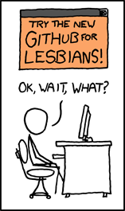

# Hello, I'm Cass 👋

[<a href="https://owly.fans">OwlyFans</a>] [<a href="https://neozones.club/~owly/">NeoZones</a>] [<a href="https://digipres.club/@Owly">Mastodon</a>] [<a href="mailto:OwlGal69@protonmail.com">E-Mail</a>]

Hello there, I'm Cass Python, also known by my online name of Owly - welcome to my git, hope you like it here! Why not take a look around at my repositories? I'm sure there will be something that will catch your eye.

I have a strong interest in digital preservation and because of this, a lot of my repositories that you will find on here are mirrors of other people and my own work.

I'm a big nerd when it comes to things relating to the world of ICT and outdated tech is my jam, same goes for things like websites from the 1990s.

When I'm not drooling over terribly made websites, I like to also be a nerd for other rubbish from Red Dwarf, bands like Oingo Boingo and The Beatles, plus annoying my friends over on at Discord (add me: **Owly#6604**).

I am also currently learning Esperanto as a second language, so that's something, I guess.

  
 Stuff I've done

Here are some of the highlights of some of the thing that I have published on the Web, enjoy at your own risk...

* <a href="https://github.com/DynTylluan/owlgames">/owlgames Archive</a>: A collection of vanilla Doom WADs.
* <a href="https://github.com/DynTylluan/OwlBot">OwlBot</a>: A Discord bot that I co-wrote - has a lot of small issues, but I'm proud of it.
* <a href="https://owlman.neocities.org/">OwlMan on Neocities</a>: A websitet hat I have been working on since 2016, it has been called many thing from terrible due to its source code to the maze of interesting content. Is it truly a terrible place? Well, you have to find-out for yourself.
* <a href="https://neozones.club">NeoZones Dot Club</a>: NeoZones is a shared webhost that I co-run with other friends of mine... I don't really think there is anything else I can really say about it...

  
 Repositories I Like

Thank God I have had nothing to do with anything here or else they would be terrible, but anyway, here are some repositories that I think are cool and so should you.

* <a href="https://github.com/akaAgar/png2wad">akaAgar/png2wad</a>: A tool to create Doom maps from PNG files - the future is now!
* <a href="https://github.com/chocolate-doom/chocolate-doom">chocolate-doom/chocolate-doom</a>: Doom source port that is minimalist and historically accurate.
* <a href="https://github.com/freedoom/freedoom">freedoom/freedoom</a>: A free, open source game based on the Doom engine - it's Doom, but free!
* <a href="https://github.com/imfunniee/htmlOS">imfunniee/htmlOS</a>: An OS made entirely with HTML/CSS and JS.
* <a href="https://github.com/luceraproject/abbaye-des-morts">luceraproject/abbaye-des-morts</a>: A HTML5/JS version of the game L'Abbaye des morts.
* <a href="https://github.com/timqian/chart.xkcd">timqian/chart.xkcd</a>: Create charts in the style of the xkcd comic!

More repositories that I have stared can be found <a href="https://github.com/DynTylluan?tab=stars">here</a>

  
 My GitHub Statistics

Showing off my nerd cred (if I had any)
  <table>
  <tr>
    <td>
      
    </td>
    <td>
      
    </td>
  </tr>
  </table>

